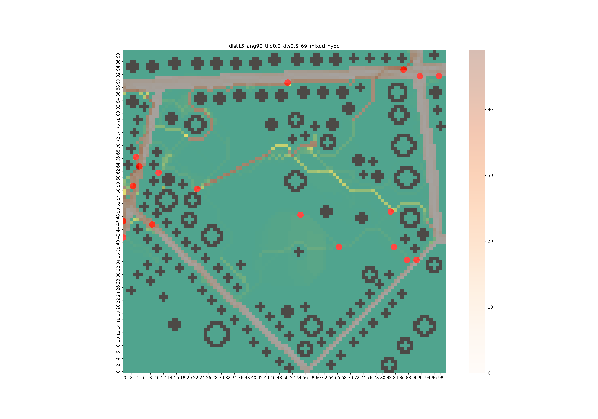

# Desired Paths Simulation

Simulation designed to explore how and on what basis people create informal shortcuts (*desired paths*) when moving through urban and park environments.  
The project focuses on understanding the mechanisms behind path formation and on predicting the main directions of emerging shortcuts using a multi-agent approach.

The model allows agents to move through a dynamic environment influenced by distance to goal and subgoals, limited perception, terrain quality (*affordance*), and obstacles. Over time, repeated usage of the terrain leads to degradation of grass and emergence of visible paths, mimicking real-world behavior observed in parks and urban spaces.

---



## Features

- Multi-agent simulation of pedestrian movement
- Dynamic terrain affordance (grass degradation and regrowth)
- Support for goals and intermediate subgoals
- Obstacle-aware navigation with safety margins
- Visualization of emerging paths and agent trajectories
- Empirical evaluation of path formation trends

---


## Tech Stack

- **Python**
- **Mesa** – multi-agent simulation framework  
- **Solara** – interactive simulation visualization  
- **Matplotlib** – plotting and result visualization  
- **OpenCV** – image-based processing and environment handling  

---

## Running the Simulation

To start the interactive simulation:

```bash
solara run main.py
```

## Notes

- Using your own Python virtual environment is also supported.
- The model is designed to capture general trends in path formation rather than exact individual trajectories.
- Performance and accuracy decrease in highly complex environments with dense obstacles.


## Configuration

### Linux

1. run `curl -sSL https://install.python-poetry.org | python3 -` (downloads poetry)
2. check if it is added to your path (`poetry --version`), and run if is not present `export PATH="$HOME/.local/bin:$PATH"`
3. run `poetry config virtualenvs.in-project true`
4. run `poetry install` or `poetry install --no-root` - creates env and downloads listed modules in .toml file
5. run `poetry shell` - to activate the env
6. run `poetry run python <python file>` - starts the program, example: `poetry run python main.py` - to run simulation without visualisation

### Windows
1. run `pip instaall poetry`
2. follow the same steps from Linux config from point 3 onwards
###

## Authors

- [Paweł Gleindek](https://github.com/pavlvs-91)
- [Kacper Gawroński](https://github.com/Gawronek69)
- [Szymon Górski](https://github.com/sggorski)

## Licence

This project is intended for academic and research purposes.
